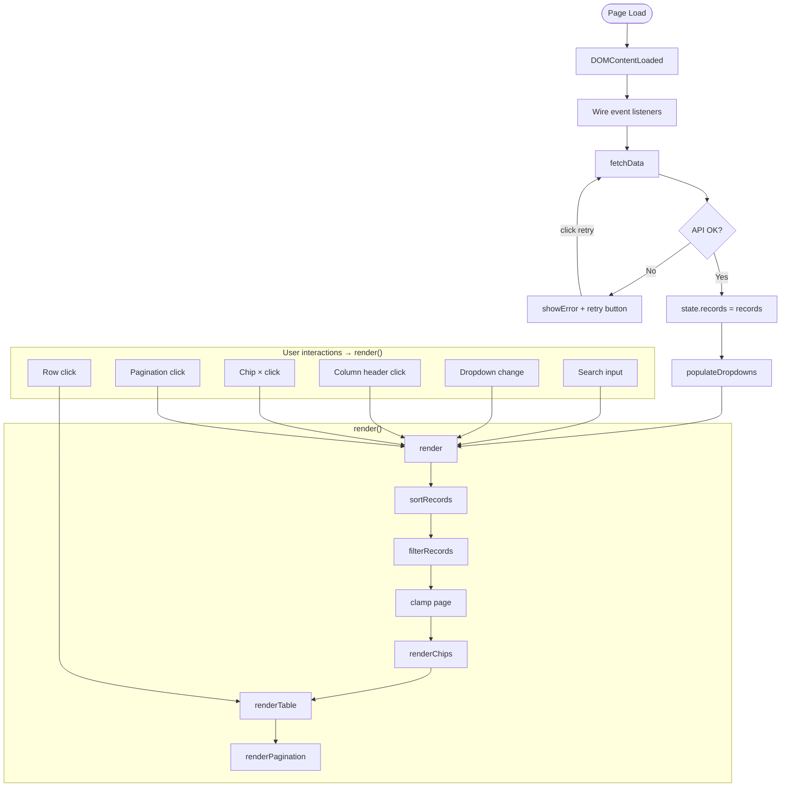

# קריאות רכב

Israeli vehicle recall browser — Hebrew RTL static site hosted on GitHub Pages.

**Live:** https://ran1979.github.io/car-call

**Data source:** [data.gov.il](https://data.gov.il/dataset/recalls) — ~3,600 recall records, fetched fresh on every page load.

## Features

- Free-text search across 7 fields
- Filter by manufacturer, model (dependent), recall year, issue type
- Active filter chips with one-click clear
- Sortable columns (click header)
- Expandable rows — full detail panel with repair method, distributor, phone, website
- 50 rows per page with pagination

## Architecture

3 static files, no build step, no dependencies:

```
index.html   — shell, RTL (lang="he" dir="rtl")
style.css    — RTL layout, table, chips, filter panel
app.js       — state, pure functions, DOM renderers, event wiring
```

Deploy = `git push`. GitHub Pages serves from `main` branch root.

## App Flow



## Pure Functions

| Function | Input | Output |
|---|---|---|
| `filterRecords(records, filters)` | full record array + filter state | filtered array |
| `sortRecords(records, col, dir)` | array + column + direction | sorted copy |
| `paginate(records, page, size)` | array + page number + page size | one page slice |
| `getDistinct(records, field)` | array + field name | sorted distinct values |

Tests: open `test.html` in browser — 24 assertions covering all 4 functions.
